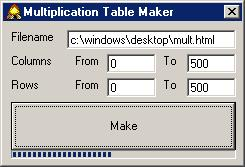



## Multiplication Table Maker

### Description

It generates a multiplication table, (HTML document) and send it to the tray. Now with progress bar! (please give rating or feedback)
 
### More Info
 
Filename, Start of column, end of column, start of row, end of row

An HTML, with a table of the multiplication table, very easy to cut and paste into your HTMLs or print out as it it.

             |
---                |---
**Submitted On**   |2001-09-06 16:02:18
**By**             |[Michael Thomas](https://github.com/Planet-Source-Code/PSCIndex/blob/master/ByAuthor/michael-thomas.md)
**Level**          |Intermediate
**User Rating**    |4.7 (14 globes from 3 users)
**Compatibility**  |VB 6\.0
**Category**       |[Math/ Dates](https://github.com/Planet-Source-Code/PSCIndex/blob/master/ByCategory/math-dates__1-37.md)
**World**          |[Visual Basic](https://github.com/Planet-Source-Code/PSCIndex/blob/master/ByWorld/visual-basic.md)
**Archive File**   |[Multiplica25993962001\.zip](https://github.com/Planet-Source-Code/michael-thomas-multiplication-table-maker__1-26957/archive/master.zip)

